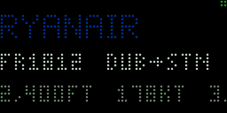

# SkyPanel

A DIY WiFi LED flight tracker: a 64×32 RGB matrix that shows the nearest aircraft in
real time — the airline name in its brand colour, plus route, aircraft type, altitude,
speed and distance.



*That's the emulator, running the firmware's own renderer.*

## What's here

| Path | What it is |
|---|---|
| `backend/` | Python 3.12 / FastAPI. Talks to ADS-B feeds, enriches, caches, and emits a *semantic* display frame. |
| `firmware/` | C++17 for an ESP32-S3 MatrixPortal. `lib/render/` is shared with the emulator and compiles for both targets. |
| `emulator/` | SDL2 desktop host running the **same** renderer, with LED-dot simulation, gamma, bloom and headless PNG snapshots. |
| `docs/` | [Architecture](docs/ARCHITECTURE.md) · [Hardware & BOM](docs/HARDWARE.md) · [Operations](docs/OPERATIONS.md) |
| `deploy/` | systemd unit, Dockerfile and compose file for the Pi. |

## The core idea

The emulator is not a mock. `firmware/lib/render/Renderer.cpp` draws into an
`Adafruit_GFX` `GFXcanvas16`. That canvas is then blitted to *either* a HUB75 panel or an
SDL2 window. One renderer, two backends — what you see on the laptop is what lights up on
the panel, down to the LED fill factor and the driver's gamma ramp.

The backend never sends pixels. It sends this:

```json
{
  "mode": "nearest",
  "source": "local",
  "lines": [
    {"text": "RYANAIR", "colour": "#073590", "style": "title", "scroll": "auto"},
    {"text": "FR1812  DUB→STN  B738", "colour": "#c8c8c8", "style": "body"},
    {"text": "24,000FT  410KT  6.1MI", "colour": "#808080", "style": "body"}
  ],
  "progress": null,
  "status": "live"
}
```

Units, colours, route formatting and field selection are all applied server-side from
user settings. The firmware contains no business logic about any of it.

## Quick start

No receiver and no hardware required — the mock source replays recorded snapshots.

```bash
# Backend
cd backend
uv sync
uv run skypanel-serve                       # http://localhost:8000

# Emulator (in another terminal)
cmake -B emulator/build -S emulator && cmake --build emulator/build -j
./emulator/build/skypanel-emu --backend http://localhost:8000
```

Or skip the backend entirely:

```bash
./emulator/build/skypanel-emu --frame emulator/fixtures/ryanair.json
./emulator/build/skypanel-emu --scenario emulator/fixtures/busy.jsonl --speed 4
```

Point it at a real receiver by editing `backend/config.toml`:

```toml
[source]
mode = "local"
local_host = "raspberrypi.local"
```

…or at a public aggregator if you don't have one — see
[OPERATIONS.md](docs/OPERATIONS.md#configuration).

## Development

Recipes live in the `justfile`; each is a plain command if you'd rather not install
[`just`](https://just.systems).

```bash
just              # list everything
just test         # 168 pytest + 108 native C++ + 19 golden images
just lint         # ruff + ruff format --check + mypy --strict
just emu          # emulator against a local backend
just show FRAME   # render one frame file in a window
just record       # write a GIF of the recorded scenario
```

Nothing in the test suite touches the network. Every external HTTP interaction is
replayed from a cassette **through the real client**, so the retry policy, the timeouts
and the rate limiter are all exercised — only the socket is replaced.

The golden images are the regression suite for fonts, layout, scrolling and colour. If a
change to the renderer is intended:

```bash
just approve-snapshots
```

### Emulator CLI

```
--backend URL      poll URL/api/frame            --pitch P3|P4    emitter size
--frame FILE       one static frame              --scale N        screen px per LED
--scenario FILE    replay a .jsonl               --gamma G        driver gamma (2.2)
--snapshot OUT.png headless, for tests           --brightness N   1-255, dimmed as the driver dims
--record OUT.gif   animated GIF                  --bloom          camera-style glow
--speed N          run the clock N× faster       --web PORT       browser view over WebSocket
--time MS          freeze the clock
```

Keys: space/↑ = top button, ←/→ = front pair, `s` screenshot, `b` bloom, `p` pitch,
`[`/`]` brightness, `q` quit.

## Notes on the build

A few things differ from a first reading of the spec, each for a reason:

- **The emulator builds with CMake, not PlatformIO's `native` env.** It needs pkg-config
  and a real linker for SDL2 and zlib. `platformio.ini` still defines both environments
  and both compile the same shared sources; the C++ unit tests run under either.
- **The desktop HTTP client uses POSIX sockets rather than libcurl.** The whole client is
  one blocking GET of a sub-kilobyte document from a LAN host; 60 lines of socket code is
  a smaller thing to depend on than libcurl and its TLS stack.
- **The bundled fixtures and `airports.csv` were authored, not downloaded.** The build
  machine could not reach ourairports.com or a live receiver. `just capture-fixtures`
  records real snapshots and `just reduce-airports` regenerates the airport table from a
  fresh OurAirports export; both produce the same shapes.
- **The panel fonts are hand-authored rather than reused from Adafruit_GFX.** At 64 px
  wide the smallest bundled face fits ten characters on a line, and the telemetry line is
  twenty-two. See `firmware/lib/render/fonts/generate_fonts.py` for the reasoning and the
  glyph art.

## Data attribution

Aggregator feeds carry licence obligations. adsb.lol is ODbL; adsb.fi requires
attribution and is non-commercial. The settings UI and `/api/frame` both name the
provider serving each frame — don't remove that.

Airport data from [OurAirports](https://ourairports.com/data/) (public domain).
Route and aircraft enrichment from [adsbdb.com](https://www.adsbdb.com), with optional
[FlightAware AeroAPI](https://flightaware.com/aeroapi/) behind a hard quota guard.
